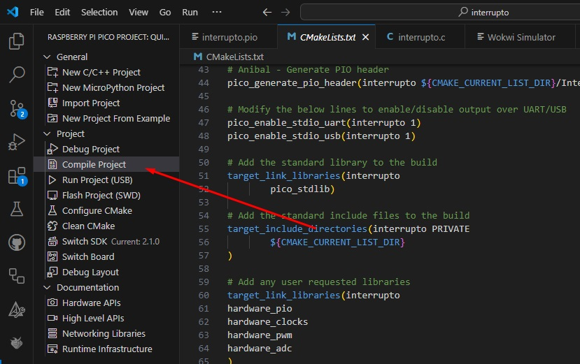
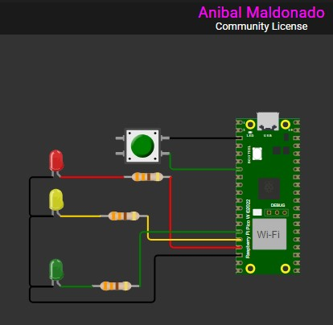

# OneShot - Controle de LEDs com Botão e Temporizador no Raspberry Pi Pico W

## 📌 Sobre o Projeto
Este projeto implementa um **sistema de controle de LEDs** utilizando um **botão** e um **temporizador** no Raspberry Pi Pico W. O sistema acende três LEDs simultaneamente quando o botão é pressionado e os apaga **em sequência**, com um intervalo de 3 segundos entre cada um.

A implementação inclui um mecanismo de **debounce via software** para evitar leituras erradas do botão.

## 🛠️ Tecnologias Utilizadas
- **Linguagem:** C
- **Microcontrolador:** Raspberry Pi Pico W
- **Bibliotecas:**
  - `pico/stdlib.h`
  - `hardware/gpio.h`
  - `hardware/timer.h`
- **Simulador:** Wokwi
- **Compilação:** CMake

## 🚀 Como Funciona
1. Quando o botão é pressionado:
   - Todos os LEDs acendem.
   - Um temporizador é ativado para desligar os LEDs **um por um** a cada 3 segundos.
2. Quando o último LED se apaga, o sistema fica pronto para um novo acionamento.
3. O botão conta com um **sistema de debounce** para evitar leituras erradas por ruído mecânico.

## 🔧 Hardware Utilizado
- **Raspberry Pi Pico W**
- **3 LEDs** (vermelho, amarelo e verde)
- **3 resistores de 330 Ω**
- **1 botão push-button**
- **Fios e protoboard**

## 🔌 Ligações
| Componente | Pino do Pico |
|------------|--------------|
| LED Vermelho | GPIO13 |
| LED Amarelo | GPIO12 |
| LED Verde | GPIO11 |
| Botão A | GPIO5 |

## 🖥️ Como Instalar
1. Clone este repositório:
   
        git clone https://github.com/JoseBrunoSouza/Subgrupo-7.git
2. Compile o código::

       No SDK do VS code aaperte em compilar segundo imagem
   
   
   
3. Com a placa BitDogLab conectada no computador em modo Bootsel envie o arquivo `.uf2` gerado

4. Esquema de conexões caso não tenha a placa BitDogLab
   
   
5. **Pressione os botões** para alternar os padrões exibidos na matriz.

## 📌 Melhorias Futuras
- Adicionar feedback sonoro com buzzer.
- Implementar controle via comunicação serial.

## 📜 Licença
Este projeto está sob a licença **MIT**.

---
✉️ **Autor:** Anibal Maldonado 🚀

